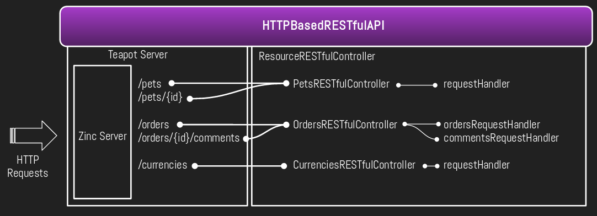

# Architecture

Stargate is built on top of [Zinc HTTP Components](https://github.com/svenvc/zinc)
and [Teapot](https://github.com/zeroflag/Teapot). Zinc is used as an HTTP server
and Teapot is used for routing.

Here's a simplified architecture diagram:



## HTTPBasedRESTfulAPI

This class is responsible for installing and configuring a set of controllers and
starting the server.
The user must provide two objects on instance creation:

- `configuration`: Any object convertible to a dictionary containing
  configuration parameters. In particular, is delegated to `Teapot`.
- `controllers`: A list of controllers to be installed.

### Additional Configuration

- **CORS**: You can configure the CORS support by sending the message
  `allowCrossOriginSharingApplying:` to the API with a configuration block.
  Follow this [link](CrossOriginResourceSharing.md) for more details.
- **Top Level Error Handlers**: The API always configures an error handler for
  `HTTPClientError` generating a response with the corresponding error code and
  additional details when available. However, users are allowed to configure
  additional error handlers by sending: `on:addErrorHandler:` with the Exception
  to handle and a block that will receive the handled exception and the current
  request.

### Installing and controlling

Once you finish the configuration you must send to the API the message `install`.
This will configure the supported routes and the exception handlers on Teapot.

To start the server, send to the API the message `start`. Send `stop` to stop it.

For example:

```smalltalk
| api |
api := HTTPBasedRESTfulAPI
  configuredBy: {
    #port -> 9999.
    #serverUrl -> 'http://api.example.com' asUrl
    }
  installing: {
    SouthAmericanCurrenciesRESTfulController new
    }.

api
    install;
    start
```

## ResourceRESTfulController

A controller is responsible for providing a set of routes to be configured in
an API and acts as the mediator between the HTTP Server and the request handlers
it manages. To fulfill its purpose it will configure one or more request
handlers and collaborate with them to implement the methods required in every
route it declares.

## Request processing pipeline

Every time a new HTTP request is received it is handled first by `Zinc Server`
and in collaboration with `Teapot Server`, a specific route is matched against
the URI and the HTTP method involved in the request.

- If no route is found a `404/Not Found` error is returned.
- If a route is matching the URI but not the HTTP method a
  `405/Method Not Allowed` error is returned.
- If a matching route is found:
  - A handler block is evaluated with the `HTTP request` and a new instance of
  `HttpRequestContext`. This context is carried over the whole response
  computation so any component involved can share contextual information related
  to the current request. A handler block usually involves sending a message to
  a controller with the two mentioned arguments.
  - The receiving controller will collaborate with one of its request handlers
  to compute the response, in case an `HTTPClientError` is raised it will be
  handled by one of the high-level exception handlers and produce a 4XX response.
